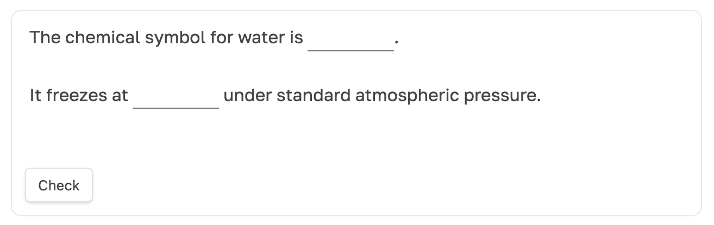

# Quiz Blocks [](https://obsidian.md/plugins?id=quiz-blocks)

> 📖 **繁體中文版**請見 [README-zh-TW.md](README-zh-TW.md)

Render ` ```quiz ` code blocks into interactive multiple-choice quizzes directly inside Obsidian notes.


## How it works

Describe a quiz using a YAML code block tagged with `quiz`. The plugin transforms it into a fully interactive form. Depending on the quiz type, one or multiple `options` can be selected. A **Check** button highlights correct, incorrect, and missed answers, with optional `feedback` commentary — great for self-study and learning notes.


## Quick quiz insertion

In the editor, type `quiz:` on a **standalone blank line**, use the arrow keys to pick a quiz type, and press **Enter** — the full YAML block is inserted with the question text pre-selected so you can start typing immediately. You can also run **Insert quiz template** from the command palette.

| Shorthand | Quiz type |
|---|---|
| `quiz:radio` (also `quiz:ratio`) | Single-choice |
| `quiz:checkbox` | Multiple-choice |
| `quiz:text` | Free-text answer |
| `quiz:prompt` | Fill-in-the-gaps (`==answer==` marks blanks) |
| `quiz:choice` | Dropdown matching |
| `quiz:noodle` | Line-connecting matching |

These shortcuts **expand a template in the editor** — they require selecting the suggestion item and do not define a new Markdown syntax. They do not trigger inside YAML front matter, code blocks, or inline sentences.

Open **Settings → Quiz Blocks** to toggle quick insertion, choose a display style (default / card / compact), and configure whether new templates shuffle options or hide the question by default. Styles apply immediately; template defaults only affect blocks inserted or duplicated afterward. The settings page includes six live-interactive template previews, a full syntax reference, and **Copy / Insert into note** buttons.


## Start a quiz from a note or tag

1. Run **Quiz Blocks: Start quiz from note or tag** from the command palette, or click the checklist ribbon icon.
2. Choose **Note** to search for a single note, or **Tag** to collect quizzes across matching notes.
3. Review the number of quiz blocks found, optionally enable **Shuffle questions**, then click **Start quiz**.
4. Answer and check each quiz, then advance or skip it. At the end, review the summary and retry incorrect or skipped questions.

The quiz bank uses existing fenced `quiz` blocks — it does not generate questions from ordinary prose. Tags come from both note properties and inline tags. Selecting `#study` also includes `#study/history`, but not `#study-guide`. Each block is one quiz step, including blocks containing multiple matching questions.

Without shuffling, questions follow note-path and block order. Invalid blocks are reported and skipped. Links and images resolve relative to the original note. Radio, checkbox, choice, and noodle blocks count as correct only when the whole block is answered correctly; text and prompt blocks count as reviewed without automatic grading. Results are not saved; closing the dialog ends the session. Gated blocks open directly during a session.


## Supported quiz types

### `radio` — single correct option


<details><summary>show code</summary>

````yaml
```quiz
type: radio
content: >-
    When you are merging onto the freeway, you should be driving:

options:
- content: 5 to 10 MPH slower than the traffic on the freeway.
  feedback: When merging onto the freeway if you are travelling slower than the traffic around you, other drivers will have to brake or change lanes in order to allow you to enter the flow of traffic. This could cause drivers to make sudden changes which may cause accidents.

- content: The posted speed limit for traffic on the freeway
  feedback: The posted limit for any roadway is a limit and may not be a safe speed for traffic under current conditions. When merging into traffic, the most important thing is to be travelling at approximately the same speed as those around you so that you can join the flow of traffic with the least disruption.

- content: At or near the same speed as the traffic on the freeway.
  feedback: If you are driving at or near the speed of traffic around you, you will be able to merge into the right hand land with minimal disruption to the flow of traffic around you.
  correct: true
```
````

</details>

### `checkbox` — multiple correct options


<details><summary>show code</summary>

````yaml
```quiz
type: checkbox
content: >-
  When do you call the police?

options:
- content: You witnessed a crime.
  correct: true
- content: You got an injury.
- content: Somebody else got an injury.
  correct: true
- content: You need a pizza.
  feedback: Very funny.
- content: You've seen a suspect.
```
````

</details>

### `choice` — multiple questions sharing the same options


<details><summary>show code</summary>

````yaml
```quiz
type: choice
content: >-
  Answer the following questions with one of: true, false, unknown.

options:
- id: true
  content: True.
- id: false
  content: False.
- id: unknown
  content: Unknown.

questions:
- content: Coconut may have bisexual flowers.
  correct_option: true
- content: 1970 is the year when George Washington delivered the first State of the Union.
  correct_option: true
- content: The hell exists.
  correct_option: unknown
```
````

</details>

### `noodle` — connect questions with matching options


<details><summary>show code</summary>

````yaml
```quiz
type: noodle
content: >-
  Connect each country with its capital.

options:
- content: Moscow
- content: Paris
- content: Oslo
- content: Kiev

questions:
- content: France
  correct: Paris

- content: Norway
  correct: Oslo

- content: Ukraine
  correct: Kiev
```
````

</details>

### `text` — free text without forced validation


<details><summary>show code</summary>

````yaml
```quiz
type: text
content: >-
    Should you believe in God?

# optional reference answer shown after pressing [Check]
correct: >-
    Well, there is no the right answer here, as it's all personal.
```
````

</details>

### `prompt` — fill in the ==gaps==



<details><summary>show code</summary>

````yaml
```quiz
type: prompt
content: |-
	The chemical symbol for water is ==H²O==.

	It freezes at ==0°C== under standard atmospheric pressure.

# optional feedback shown after pressing [check]
feedback: >-
  Use ==double equals== to hide text until you reveal the answer.
```
````

</details>


## Features

#### `shuffle: true`

Quiz options are **shuffled** on each render to reduce pattern recognition and prevent memorising answer positions. Default: `false`.

#### `gated: true`

Quiz content is **hidden** until you complete or dismiss the quiz, encouraging closed-book testing and active recall. Default: `false`.


## Installation

### From Obsidian Community Plugins *(pending approval)*

**Quiz Blocks** is currently awaiting approval to appear in the official Obsidian Community Plugins list. In the meantime, install via BRAT or manually.

#### Install using BRAT (recommended for beta)

<details><summary>show steps</summary>

1. Install the **BRAT** plugin from the community plugins browser, or via this link: https://obsidian.md/plugins?id=obsidian42-brat
   - Click **Install**, then **Enable**.
2. Open **Settings → BRAT**.
3. Click **Add Beta plugin**.
4. Paste the repository URL:
   ```
   https://github.com/xamgore/obsidian-quiz-blocks
   ```
5. Click **Add plugin**.
6. Go to **Settings → Community plugins** and enable **Quiz Blocks**.

</details>

#### Install manually (from GitHub)

<details><summary>show steps</summary>

1. Download `obsidian-quiz-blocks.zip` from the [GitHub releases page](https://github.com/xamgore/obsidian-quiz-blocks/releases).
2. Extract the ZIP file.
3. Copy the extracted folder into your vault's plugin directory: `YOUR_VAULT/.obsidian/plugins/`
4. Restart Obsidian or go to **Settings → Community plugins** and click **Reload plugins**.
5. Enable **Quiz Blocks** from the list.

</details>

#### ~~Install by link~~ / ~~Install from Community Plugins browser~~

<details><summary>show steps</summary>

These methods will be available once the plugin is approved.

1. Click https://obsidian.md/plugins?id=quiz-blocks
2. Click **Install**, then **Enable**.

</details>

### Local development deployment

Run the interactive deploy wizard from your terminal:

```bash
./auto-deploy.sh
# or
npm run deploy
```

The wizard lets you:
1. **Select a Vault** — picks up all Obsidian-registered vaults automatically; arrow keys to choose, or enter a path manually.
2. **Choose build mode** — rebuild from source (recommended) or deploy existing artifacts.
3. **Optionally remember** the chosen vault for next time.
4. **Confirm** the summary before anything is written.

Press `↑`/`↓` to navigate, `Enter` to confirm, `q` or `Ctrl+C` to cancel.

For non-interactive / CI use:

```bash
./auto-deploy.sh --vault "/path/to/your/vault"
./auto-deploy.sh --vault "/path/to/your/vault" --skip-build
```

To set a persistent default vault, copy `.quiz-blocks-dev.example.json` to `.quiz-blocks-dev.json` and set `vaultPath`. This file is gitignored. Vault resolution order: `--vault` flag → `DEMO_VAULT` env var → `.quiz-blocks-dev.json`.

The script only overwrites `main.js`, `styles.css`, and `manifest.json` inside `.obsidian/plugins/quiz-blocks/` — your `data.json` and notes are untouched.


## Notes & limitations

This is an early-stage plugin; bugs are possible. Feel free to [open an issue](https://github.com/xamgore/obsidian-quiz-blocks/issues/new/choose) and share feedback.

- No syntax highlighting in the YAML editor (vote [#3](https://github.com/xamgore/obsidian-quiz-blocks/issues/3)).
- Error messages for missing fields can be cryptic (vote [#4](https://github.com/xamgore/obsidian-quiz-blocks/issues/4)).
- Answers are ephemeral — kept only until the tab is closed. Vote [#2](https://github.com/xamgore/obsidian-quiz-blocks/issues/2) if you'd like persistence.
- `instant` feedback mode is not yet implemented.
- More quiz types planned: `cards`.


## Motivation

These are just a few examples of recurring requests in the Obsidian community around lightweight quiz functionality.

> [@amcasas:](https://forum.obsidian.md/t/quiz-type-plugin/2237) need some type of quiz function that you can add at the end of each note

> [@deleted:](https://www.reddit.com/r/ObsidianMD/comments/1ns1g7z/making_mcq_questions_in_obsidian/)
> in such a way that a maximum of one option is choosable for each question.

> [@30DayThrill:](https://www.reddit.com/r/ObsidianMD/comments/17lcsvf/quizzing_plugin_strategies_for_obsidian/)
> looking for a quizlet-esque solution where I can create more multiple choice or question and answer style tests.

If you find this plugin useful, please consider telling others about it or starring the repository&nbsp;⭐️

<br>
<br>
